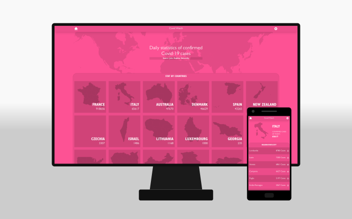

# CovidWatch
An educational project to call APIs using React, Redux and Tailwindcss.

## Built With

- Reactjs
- Redux
- Tailwindcss

## Demo



A live demo of this project is available [on Heroku](https://covid-watch-ahangarha.herokuapp.com/).

## Usage

To build the project run:

```
$ npm install
$ npm run build
```

## Development

In development environment use the following command:

```
$ npm start
```

## Author

👤 **Mostafa Ahangarha**

- GitHub: [@ahangarha](https://github.com/ahangarha)
- Mastodon [@ahangarha@mas.to](https://mas.to/@ahangarha)
- Twitter: [@ahangarha](https://twitter.com/ahangarha)
- LinkedIn: [ahangarha](https://linkedin.com/in/ahangarha)

## 🤝 Contributing

As an educational project at this stage I am not supposed to accept any PR. Yet I appreciate if you can report problems from [issues page](../../issues/).

## Show your support

Give a ⭐️ if you like this project!

## Acknowledgments

- Maps are used from [MapSVG](https://mapsvg.com), licensed under [CC BY 4.0](https://creativecommons.org/licenses/by/4.0/).
- Design is inspired from a design made by [Nelson Sakwa](https://www.behance.net/gallery/31579789/Ballhead-App-(Free-PSDs)).
- Linters are made by [Microverse Inc](https://github.com/microverseinc/linters-config/).

## 📝 License

This project is released under [AGPL](./LICENSE) licensed.
